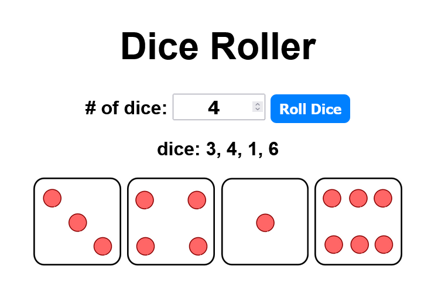

# Dice-Roller

To test the program, download the files and run the index

## The Project

The dice roller was created with HTML5, CSS3 and JavaScript  
The main focus of the project is having easy to understand code, good readability and a functional JavaScript dice roller  
You can roll as many dices as you want!
